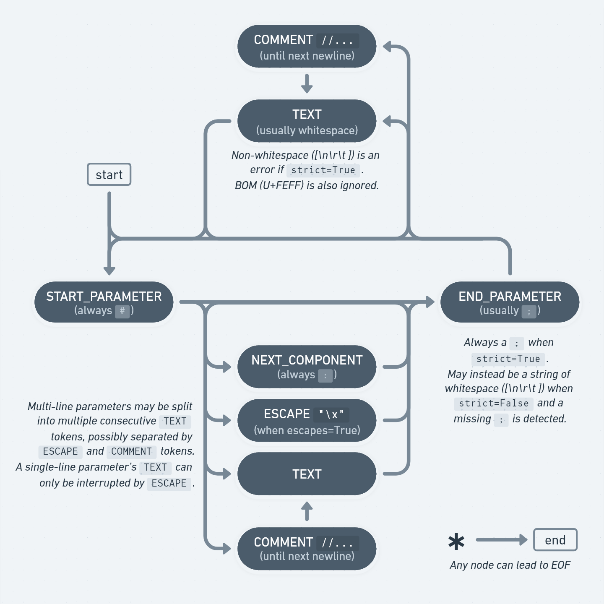

Using the lexer
===============

:func:`.parse_msd` is sufficient for most use cases.
However, **msdparser** exposes the underlying lexer, :func:`.lex_msd`, as a part of its public API for advanced use cases.

Some of those use cases might include...

* You want to edit simfiles while preserving whitespace & comments.
* You only need the metadata at the top of the file and want to stop at the first :code:`NOTES` key, without also reading the note data.
* You are streaming data from an untrusted source and want to avoid consuming unbounded input.
* Your application is user-facing and you want to pass control back to the main loop more consistently than :func:`.parse_msd`.

Together with :func:`.parse_msd`'s `tokens` parameter, you can effectively run arbitrary code between the lexer & parser:

.. doctest::

    >>> from msdparser import parse_msd
    >>> from msdparser.lexer import lex_msd
    >>> def limited_lexer(file):
    ...     chars_read = 0
    ...     for (token, value) in lex_msd(file=file):
    ...         chars_read += len(value)
    ...         if chars_read > 1_000_000:
    ...             print("Too much input, short-circuiting")
    ...             return
    ...         yield (token, value)
    ...
    >>> with open('testdata/Springtime.ssc', 'r', encoding='utf-8') as simfile:
    ...     limited_params = list(parse_msd(tokens=limited_lexer(simfile)))

If this seems useful to you,
continue reading for the function's documentation and a state diagram of its output.

.. autoclass:: msdparser.lexer.lex_msd
    :noindex:

State diagram
-------------

Inside of a parameter (between the :code:`#` and :code:`;`),
text, :code:`:` separators, :code:`\\` escapes, and :code:`//` comments are all valid.
Outside of a parameter, only text and comments are valid.
"Text" includes whitespace, such as line breaks, which will commonly be found between parameters.
